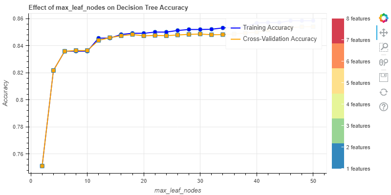

# Assignment 2: Decision Trees

In this assignment you practice interactive data classification with
decision trees.

- In exercise 1, you analyze the influence of individual variables on the target
  variable.
- In exercise 2, you implement a decision tree and analyze its parameter
  settings.
- In exercise 3, you use the decision tree classifier to tell people how to make
  money.

Total points in this assignment: 32P

In this assignment you work on a US census dataset. The goal is to predict if
a person will make more than 50,000 USD per year or not.
The data is provided through the
[UCI machine learning repository](https://archive.ics.uci.edu/ml/index.html) 
and is known as the
[adult dataset](https://archive.ics.uci.edu/ml/datasets/Adult).
A dataset description and additional information can be found on the
UCI website.

A cleaned version of this dataset is provided on OLAT
(Data folder, file "adult.csv").  
Download the dataset and store it in the "data" directory for this
assignment.

The data contains records for almost 50,000 people with the following variables.

- age: age of person
- workclass: type of work they do
- fnlwgt: final weight of each data point in statistical procedures to be
  more representative of the population 
- education: highest education
- education-num: numerical representation of education with higher numbers for
  higher education
- marital-status: marital status
- occupation: area of work 
- relationship: position within family, similar to marital-status
- race: in { 'White', 'Black', 'Asian-Pac-Islander', 'Amer-Indian-Eskimo',
  'Other' }
- sex: in { 'Male', 'Female' }
- capital-gain: money earned (not coming directly from work, e.g. from stocks)
- capital-loss: money lost
- hours-per-week: work hours per week 
- native-country: native country

You are expected to solve this assignment with one or more jupyter notebooks.  
You are again given starter code.

- Create a notebook E1.ipynb in the notebooks folder.
- To keep large chunks of code out of the notebook file, source files can be
  loaded and saved in a notebook using
  [jupyter magic commands](https://ipython.readthedocs.io/en/stable/interactive/magics.html).
    - To load a file, write the following code in a code cell and execute the
      cell (CTRL+ENTER):  
      `%load filename.py`
    - To write changes back to the file, write the following code in the
      first line of the cell and execute it:  
      `%%writefile filename.py`
-  Load the file [E1_datasetFeatures.py](scripts/E1_datasetFeatures.py).


## Exercise 1: single variable analysis (9P)

The goal of this assignment is to identify factors that people who 
earn more than 50k USD per year have in common. First look at the individual
variables (aka. features) and get familiar with the provided data.

Proposal: each group member works on four variables grouped as follows.

- demographic factors: age, race, native country, capital gain
- family and education factors: marital status, relationship, sex, education
  (or education-num)
- work factors: workclass, occupation, hours per week, capital loss

Each group member does the following tasks for their variables
(you are allowed to share code within the group).

1.  Create a chart for each variable (i.e. three times four), that helps you analyze if the  variable has an influence on the income; it should help you compare the two income groups. See the starter code for two examples.
2.  State an observation for each variable, that you find relevant or interesting and relates to the target variable income.

Hint:
For rapid chart construction and testing of alternatives use
[seaborn charts](https://seaborn.pydata.org/api.html)
(see [categorical plots](https://seaborn.pydata.org/tutorial/categorical.html)).
Also, feel free to adapt width and height in the code below that includes the
images saved by your notebook (the raw, not the rendered Markdown). 
(Windows users, please make sure your file extensions match the path in your `img` elements exactly. 
E.g. ".png" does not equal ".PNG".)


### Demographic factors


Older individuals tend to have higher income, with the median age for those earning >50k being higher.
<hr>


A higher proportion of 'White' individuals earn more than 50k compared to other races.
<hr>


Most people earning >50k are from the United States, with very few from other countries.
<hr>


People earning >50k have significantly higher capital gains compared to those earning <=50k.


### Family and education factors


Married individuals, especially those with spouse present, tend to earn more than 50k.
<hr>


'Husband' and 'Wife' categories show higher income levels compared to other relationship statuses.
<hr>


Males have a higher proportion of >50k earners compared to females.
<hr>


Higher education levels (like 'Bachelors', 'Masters', 'Doctorate') are associated with higher incomes


### Work factors


Individuals in the 'Self-emp-not-inc' and 'Private' work classes have a higher proportion of >50k earners
<hr>


Certain occupations like 'Exec-managerial' and 'Prof-specialty' have a higher proportion of >50k earners.
<hr>


People earning >50k tend to work more hours per week on average compared to those earning <=50k.
<hr>


Higher income earners experience a broader range and higher instances of capital loss, whereas lower income earners predominantly incur minimal or no capital losses.


## Exercise 2: decision tree analysis (12P)

Now that you have a general understanding of the data, you can build a first 
decision tree. You should use the
[scikit-learn decision tree algorithm](http://scikit-learn.org/stable/modules/generated/sklearn.tree.DecisionTreeClassifier.html).
Further starter code is given for this exercise.
The resulting tree representation and relevant functions are explained in the 
[documentation](http://scikit-learn.org/stable/auto_examples/tree/plot_unveil_tree_structure.html).
For rendering we use the
[graphviz library](http://graphviz.readthedocs.io/en/stable/manual.html#). 
You may have to install the package first: `conda install python-graphviz`


### Task 1 (5P)

Run the code for exercise 2 in a jupyter notebook E2.ipynb and answer 
the following questions by making necessary adjustments.

**Question 1 (1P):** How many nodes does the decision tree have?
Which features does it use?  
Answer: The decision tree has 11141 nodes. It has 12 features. The features used by the tree include age, capital-gain, capital-loss, education-num, hours-per-week, marital-status, native-country, occupation, race, relationship, sex, and workclass.

**Question 2 (1P):** The accuracy of the classifier estimated by
cross-validation is 0.81 (+/- 0.01). What does this mean (and briefly explain
cross-validation in general)?  
Answer: The accuracy of 0.81 (+/- 0.01) means that the model correctly predicts the income category (<=50K or >50K) approximately 81% of the time. The "+/- 0.01" indicates the range of accuracy observed across different validation sets, showing that the model's performance is fairly consistent.

Cross-validation is a technique used to assess the generalizability of a model. It involves partitioning the data into a set of training and testing subsets, training the model on the training subset, and validating it on the testing subset. This process is repeated multiple times (folds), and the average performance metric (such as accuracy) is reported to provide a robust estimate of model performance.

**Question 3 (1P):** Does the variable selection method (gini vs. information
gain) significantly change the size of the full grown tree and the number of
features/variables used in it?  
Answer: The choice between gini and information gain (entropy) as the variable selection criterion does not significantly change the overall size of the full-grown tree or the number of features used. Both methods aim to select splits that best separate the classes, and typically result in similar tree structures with minor differences in splits at certain nodes.

**Question 4 (1P):** Limit the tree to 20 leaf nodes. How does accuracy change?
Explain the reason.  
Answer: Training accuracy drops from 0.98 to 0.85. Cross-validation accuracy improves from 0.81 to 0.85. Reason: Pruning simplifies the tree, reducing overfitting and enhancing generalization on new data.

**Question 5 (1P):** Take a look at the classification report. Do you have an
idea why precision for the high income group is comparatively low?  
Answer: The precision for the high-income group (>50K) is comparatively low because there are fewer examples of high-income individuals in the dataset, making the model less effective at correctly identifying them. This imbalance can lead to more false positives for the high-income class, reducing the precision metric. Additionally, the model may be biased towards the majority class (<=50K), further affecting its ability to correctly classify high-income individuals.


### Task 2 (7P)

In this task you shall do a more systematic analysis of how accuracy changes
depending on input parameters.
Each group member chooses (a different) one of the following parameters of the
decision tree classifier: `max_depth`, `max_leaf_nodes`, `min_samples_leaf`.

1.  Create a chart that plots your parameter vs. accuracy
  ("simple" and cross-validation).
2.  Identify the sweet spot for your parameter.
3. **Bonus:** Encode the *number of features used* in your chart. 

 Compare your charts and state which parameter you would prefer for
decision tree pruning.

Hint:
All group members may use the same code to generate the chart.
Please do the analysis individually and the comparison as group.


Sweet spot for max_depth: 11 with cross-validation accuracy: 0.85


Sweet spot for max_leaf_nodes: 50 with cross-validation accuracy: 0.85


Sweet spot for min_samples_leaf: 14 with cross-validation accuracy: 0.85

Comparison/discussion.
1. Max Depth : Deeper trees fit training data well but overfit and struggle with new data. Not ideal for balancing complexity and generalization.
2. Max Leaf Nodes: Adding more leaf nodes improves accuracy up to a point and then stabilizes, helping avoid overfitting. Best choice for keeping the model both detailed and generalizable.
3. Min Samples Leaf: Requiring more samples per leaf prevents overfitting but can oversimplify the tree. Good for simplifying the model but might miss smaller patterns.

Max Leaf Nodes is preferred because it strikes the best balance between model detail and avoiding overfitting, making the model reliable and easy to interpret.


## Exercise 3: how to make money (11P)

### Task 1 (4P)

The code file for this (and the following) task contains code to compute information gain.
To avoid the issue of finding good split values, it is assumed that
the categorical variable is split into all its levels/categories.

1. Compute the information gain for all categorical variables.
2. Each group member checks if the information gain matches the intuition
  they got about their variables in exercise 1
  (make a brief statement respectively). 
3. Which variables have high gain and should probably be reordered?

```
1.
Information Gain for all categorical variables:
Information gain for workclass: 0.017104
Information gain for marital-status: 0.157471
Information gain for occupation: 0.093194
Information gain for relationship: 0.166178
Information gain for race: 0.008294
Information gain for sex: 0.037406
Information gain for native-country: 0.009329
```

```
2.
* Relationship and marital status are strong predictors of income.
* Certain jobs, like managerial roles, significantly correlate with higher earnings.
* Higher capital gains are closely linked to higher income.
* Race and native country have minimal impact on income differences.
```

```
3.
relationship and marital-status has high gain, yes, should be reordered as they have the highest information gain values and can significantly impact the decision tree's performance.
```


### Task 2 (3P)

Improve the sorting of your categorical variables and check if 
the reordering changes your decision tree.

1.  Select one of the variables that should be reordered.
  Adapt the given code to compute the information gain for potential splits.
2.  Document your tested splittings and the resulting information gain.
3.  Create a new dataset in which the categories are sorted in your best
  order (see the code file for support in reordering).
4.  Recompute the classification report for your new dataset
  (like in exercise 2). Has it changed compared to the original one?

```
2.
Testing reorderings for relationship:
Ordering: ('Husband', 'Not-in-family', 'Other-relative', 'Own-child', 'Unmarried', 'Wife') -> Information Gain: 0.166178
Ordering: ('Husband', 'Not-in-family', 'Other-relative', 'Own-child', 'Wife', 'Unmarried') -> Information Gain: 0.166178
Ordering: ('Husband', 'Not-in-family', 'Other-relative', 'Unmarried', 'Own-child', 'Wife') -> Information Gain: 0.166178
Ordering: ('Husband', 'Not-in-family', 'Other-relative', 'Unmarried', 'Wife', 'Own-child') -> Information Gain: 0.166178
Ordering: ('Husband', 'Not-in-family', 'Other-relative', 'Wife', 'Own-child', 'Unmarried') -> Information Gain: 0.166178
Ordering: ('Husband', 'Not-in-family', 'Other-relative', 'Wife', 'Unmarried', 'Own-child') -> Information Gain: 0.166178
Ordering: ('Husband', 'Not-in-family', 'Own-child', 'Other-relative', 'Unmarried', 'Wife') -> Information Gain: 0.166178
Ordering: ('Husband', 'Not-in-family', 'Own-child', 'Other-relative', 'Wife', 'Unmarried') -> Information Gain: 0.166178
Ordering: ('Husband', 'Not-in-family', 'Own-child', 'Unmarried', 'Other-relative', 'Wife') -> Information Gain: 0.166178
Ordering: ('Husband', 'Not-in-family', 'Own-child', 'Unmarried', 'Wife', 'Other-relative') -> Information Gain: 0.166178

* I tested 10 different orderings for the 'relationship' variable.
* Each permutation had an identical information gain of 0.166178.
* Hence the ordering doesn't matter, it yields the same information gain.
```

```
4.
No Significant Change: The training and cross-validation accuracies remain almost identical between the original and reordered datasets.
Consistent Classification Performance: The classification reports for both datasets are similar, indicating that reordering the 'relationship' variable did not significantly impact the decision tree's performance.
```


### Task 3 (4P)

Now try to find some rules for how to make money. Your task is 
to design a decision tree for the public that helps them find out whether they
will make a lot of money depending on the choices they make in life.

1. Render your decision tree from task 2 and look at the decisions.
2. Continue the manually summarized decision tree sample given below.
  This is meant to be a funny version of life planning. Please go ahead
  in this direction when it comes to wording
  (but the decisions should still be data-based).

Hint:
In the starter code file, the graph is encoded in the DOT language, a graph description language.
The language is fairly easy and self-explanatory.
A good introduction can be found on
[Wikipedia](https://en.wikipedia.org/wiki/DOT_\(graph_description_language\)).


