# Assignment 3: Who comes to DinoFun World and what do they do?

In this assignment you will detect groups and group types in the DinoFun World
data. A group is a set of people that spend the day together. You will also
look into outliers and the daily routine of regular visitors and unusual people.
To achieve these goals you will ...

- identify clusters in the data and describe them (exercise 1)
- implement a temporal visualization for park visitors (exercise 2)
- analyze clusters and outliers in the data (exercise 3)

Total points in this assignment: 32P


## Exercise 1: Groups in amusement parks (10P)

Your first task is to think about characteristics of groups.
For each group below, describe characteristics that may be helpful in
distinguishing them. Think of, for example, size, how long they stay in the
park, which rides they take, which other facilities/shops they use. Give at
least three characteristics for each group.
Bear in mind the data that you have available.


### Task 1 (3P)

Describe six group types that may occur in amusement parks.
You may either use the types indicated below or describe different ones
(imagination, common sense).

 Types of groups in amusement parks:

1. Family
    - size: 3-6 people
    - Attractions: Check-ins at attractions for all of ages.
    - 
2. Couple
    - size: 2 people
    - Attractions: Most Check-ins at adults attractions, food and shopping
    - 
3. Park employee (worker/security)
    - size: commonly 1 person
    - Attractions: Commonly only 1 or 2 check-ins at their work place
    - Time: The staying time should commonly be the their working time
4. School group
    - size: 20 -70 people
    - Attractions: More ckeck-ins at thrill facilities.
    - Time: Because of the number of people, the time they stay is commonly longer
5. Journalist/Reporter/Photographer
    - size: 3-5 people
    - Attractions: Check-ins may distribute at all facilities, because they need to document all parts of Dinofun World
6. Group of adults
    - size: 3-8 people
    - Attractions: More check-ins at thrill facilities, beer garden.
    
**Hint:** Feel free to split the groups further if you have different subtypes
in mind.

To analyze groups in our data, we first need to group visitors.
For faster computing we exploit some of the data characteristics that would not
necessarily work in real life. In our case a group

- arrives at the exact same time
- at one entrance.

Groups may split into smaller subgroups. In each subgroup the members

- take the same rides.

The file [computeGroups.py](scripts/computeGroups.py) contains Python code to
extract groups and compute a number of statistics for them, e.g. which rides do
they take, where do they eat, when do they leave the park.
For your convenience we have already added the output from this script to
the data folder as [groups.csv](data/groups.csv) (the file is relatively small).


### Task 2 (3P)

In this task you shall ("manually") look for types of visitor groups in the
data. To this end, you are given a bokeh app that renders a set of scatterplots
for the dataframe.

The scatterplots are hard-coded in the variable `plot_variables` in the file
[main.py](main.py):

```python
# create scatterplots
plot_variables = [('Departure', 'Arrival'),('Park Time','GroupSize'),('Kiddie','Thrill')]
scatter = Scatterplots(source, cols=plot_variables)
```

To run the app, go to your root directory and run:

```sh
bokeh serve --show  A3_groupAnalysis/
```

 Take a look at the list of available features on the left and test
feature combinations that may reveal clusters.
Include nine plots with good cluster structure in this document.

**Notes:**

- For a full analysis we would start with an analysis of each individual
  variable and then pairwise combinations. This is out of scope for this
  exercise. So please try the ones you deem most appropriate. Their combination
  in scatterplots is not too important.
- The feature *Entrance* counts how often a visitor group checks in at an
  entrance, i.e., it tells you if people leave the park. *Entrance Time* is
  the amount of time they spend near entrance or more likely outside the park,
  e.g., they take a break.


### Task 3 (4P)

Now describe some of the clusters you found.
Additional to the example given below, you shall describe four more types of
groups. You are already given two group type names – describe them.
Then find two new group types. Each group should form a cluster in
one of the plots – name the respective variables where you see the cluster.
See if this cluster also stands out in other variables. 
Comment on your observations.

Remember that the scatterplots support linking and brushing and zooming:
try to select a set of points with the box select tool.

 Manually found clusters in the DinoFun dataset:

1. Morning visitors (given example)
    - identified in plot arrival vs. departure
    - sample IDs: 
    - arrive between 8:00 and 9:00
    - leave between 13:00 and 14:00
    - stay together as a single group (nsubgroups = 1)
2. School Groups
    - plot: Park Time vs GroupSize
    - The number of people in groups between 30 and 75
    - Satying time of groups between 10 and 15
    - stay together as a single group (nsubgroups = 1)
3. School Groups(Primary school and Middle school)
    - plot: Kiddie vs GroupSize
    - The number of people in groups between 30 and 75
    - The number of check-ins at kid facilities between 0 and 10
    - stay together as 2 groups (nsubgroups = 2)
    - For the number of check-ins at kid facilities between 0 and 4, they could be middle school students groups.
    - For the number of check-ins at kid facilities between 4 and 10, they could be primary school students groups.
4. Family with Kids
    - plot: Park Time vs CheckinSum, Beer Garden vs GroupSize
    - The Park Time of groups between 4 and 10
    - The CheckinSum of groups between 100 and 700
    - Stay together as single group
    - These groups are usually 3-8 people
    - Because of kids, they seldom go to beer garden(Beer Garden vs GroupSize), but kiddies.
5. Adult Groups
    - Plot: GroupSize vs Kiddie, GroupSize vs Thrill
    - The GroupSize between 2 and 10
    - The Thrill between 20 and 50
    - Stay together as a single group
    - These groups seldom go to kids facilities(we could see the
      corresponding cluster in GroupSize vs Kiddie plot), but thrills.


## Exercise 2: Temporal group analysis (10P)

### Task 1 (5P)

You are given six examples of time-dependent visualizations that shall
illustrate what a visitor, group or multiple groups did during their day 
(best to open them in a new tab).

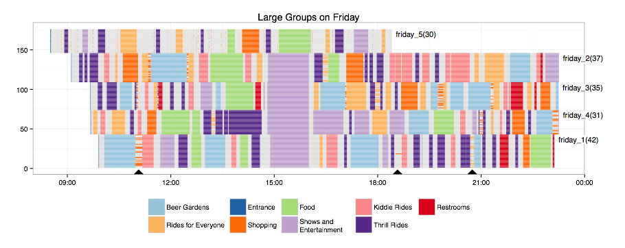

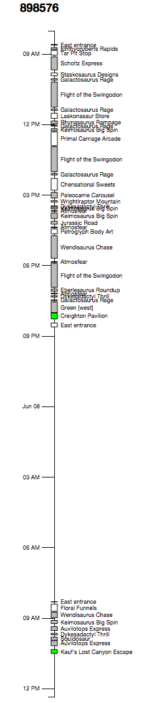

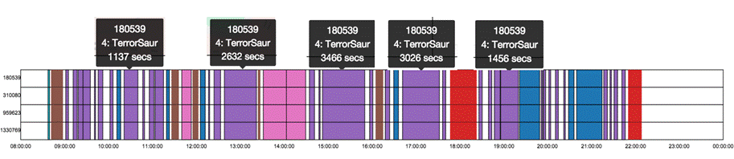

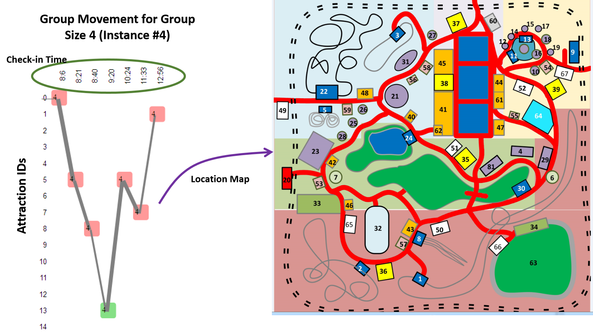

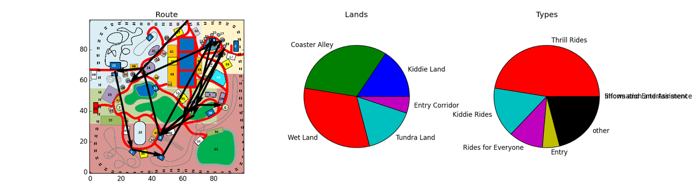

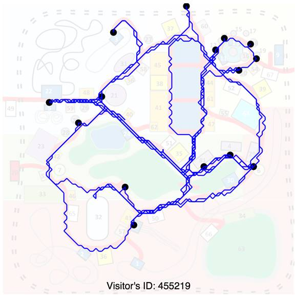

Select three visualizations and describe them.

1. Give a short description of what is depicted by each of the graphics
  (which variables and how are they encoded).
2. A list of pros and cons for each technique. What is easy to read off,
  what is more difficult, or not at all visible.
3. A brief discussion comparing the three techniques.

1. Gantt Chart Visualization:

* Description: The Gantt chart depicts the timeline of activities for various park visitors on different days. Each horizontal bar represents a visitor's activity at the park, segmented by color to indicate different attractions or activities.

* Variables Encoded:
    Horizontal Axis: Time of day
    Vertical Axis: Different days/visitors
    Color: Types of activities or attractions
    
* Pros:
    Clearly shows the duration and sequence of activities.
    Easy to track individual visitor activities over time.
* Cons:
    Can become cluttered with many visitors.
    Difficult to compare across multiple visitors on different days simultaneously.

* Overall Evaluation: It is easy to read off detailed tracking of individual timelines but difficult to analyse patterns across many visitors.


2. Detailed Timeline with Vertical Markers:

* Description: This is a vertical timeline for a single visitor, detailing each activity throughout the day. Each stop is marked along the timeline, with detailed activity labels.

* Variables Encoded:
    Vertical Axis: Time of day
    Labels: Specific activities or stops within the park
    
* Pros:
    Provides an extremely detailed account of one visitor's day.
    Easy to read detailed activities chronologically.
    
* Cons:
    Only represents data for one visitor at a time.
    Does not provide immediate visual insights into patterns or anomalies without additional context.
    
* Overall Evaluation: easy for detailed case studies of individual visitor behaviors difficult for analyzing trends or comparing multiple visitors.


3. Movement and Stay Duration Heat Map:

* Description: The third visualization uses a heat map layered over a park map, indicating the duration of stays at various attractions, represented by varying colors. Each segment of time at a location is also quantified by its duration in seconds.

* Variables Encoded:
    Spatial Layout: Park map indicating different locations.
    Color Intensity: Duration of the stay at each location.
    Annotations: Time duration in seconds at each stop.
    
* Pros:
    Provides spatial context to where visitors spend the most time.
    Useful for identifying hot spots within the park.
    
* Cons:
    Requires spatial understanding of the park's layout.
    Color shades might be difficult to differentiate precisely for detailed analysis.
    
* Overall Evaluation: easy to read off popular attractions, but it may be difficult to understand the graph for visitors unfamiliar with the park layout.


**Comparative Discussion

* The detailed timeline offers the most granularity, ideal for in-depth analysis of individual behaviors, whereas the Gantt chart and heat  map provide broader overviews suitable for quick insights into visitor flows and popular times or areas.
* The Gantt chart is the most versatile for different types of data analysis, although it can become overwhelming with large datasets. The heat map offers an intuitive understanding of spatial patterns but is less clear for exact times without additional data layers.
* For operational insights, such as managing park traffic and optimizing visitor experiences, the heat map and Gantt chart are more applicable. For customer service or detailed behavioral analysis, the detailed timeline provides the necessary depth.


### Task 2 (5P)

Implement a time-dependent visualization technique that presents the activities
for a group or a set of groups during one day in DinoFun World.

The file [timeViz.py](scripts/timeViz.py) contains some starter code.
You are given a helper routine `getStops` that extracts all places where
a person checks in or stops for more than one minute.
You can print the stops of person 885299 by running:

```sh
python3 timeViz.py
```

It is perfectly fine to reimplement one of the techniques that you have seen
above. You are also free to design a new one or combine ideas.
(Any effort here is also rewarded in exercise 3.)

Short description of what we did.

Our visualization for group 1 (choose who you like): We did bar plots for timeline Vs timetaken at each location according to checkin and movement.

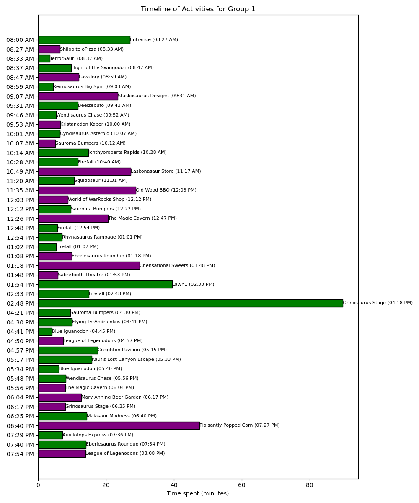


## Exercise 3: Cluster and outlier analysis (12P)

### Task 1 (6P)

The app also includes automatic clustering functionality.
Select as active features *Arrival* and *Departure*. Also change the maximal
number of clusters to 4 and press the "recompute" button. This will cluster the
data based on the active features. The dendrogram on the right-hand side depicts
the cluster hierarchy. Color is assigned to the leaf nodes. Parents are colored
in the color of the larger child. The color is forwarded to the scatterplots.

Find settings that result in clusters that give a good visual
separation of colors. Experiment with different sets of parameters and number
of clusters. Start small and increase numbers.  
Choose a setting with 4-10 clusters and a good separation of clusters
in the scatterplot. Make a screenshot and include it here.

Features: Shopping Vs GroupSize, Park Time Vs Shopping, GroupSize Vs Thrill, Kiddie Vs GroupSize, Park Time Vs CheckInSum, Beer Garden Vs GroupSize, Arrival Vs Departure, Beer Garten Time Vs Kiddie, Shopping Time Vs GroupSize
Number of clusters: 7

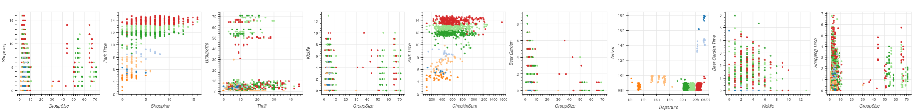


1.  Choose three clusters and describe their properties.
  Check if the automatic results match with anything from exercise 1.
  
Cluster 1 (Green Dots):

Group Size vs. Shopping: This cluster includes a wide range of group sizes, but most of the data points are concentrated between 0 to 20 group sizes with Shopping times ranging from 0 to 15.
Park Time vs. Shopping: The green cluster shows a wide distribution of Park Time, but it tends to have more data points with higher shopping times (8-15) while Park Time is widely spread from 2 to 14 hours.
Group Size vs. CheckInSum: The green dots exhibit a wide range of CheckInSum values, but a significant concentration is seen from 200 to 1000 with varying group sizes.
Kiddie vs. Beer Garden Time: Most green data points in Kiddie activities range from 0 to 6, with Beer Garden Time mainly falling between 0 to 4 hours.

Cluster 2 (Red Dots):

Group Size vs. Shopping: The red cluster also spans a broad range of group sizes, but the distribution of Shopping times is similar to the green cluster, with most points falling between 0 to 15.
Thrill vs. Group Size: The red dots indicate a wide spread of Thrill activity times, with a notable density between 0 to 20 for group sizes ranging from 0 to 70.
Group Size vs. CheckInSum: Red cluster has a high density of CheckInSum values concentrated around 200 to 800, covering a broad range of group sizes.
Beer Garden vs. Group Size: The red dots are spread throughout the plot, with no specific pattern, indicating varied Beer Garden times for different group sizes.

Cluster 3 (Orange Dots):

Group Size vs. Shopping: The orange cluster is less dense compared to green and red. It shows fewer data points, mostly scattered, indicating a smaller segment of the data.
Park Time vs. Shopping: Orange dots tend to have lower Park Times (mostly below 10) and a wide range of Shopping times.
Animal vs. Departure: This plot shows that orange dots have a range of Animal activity times from 8h to 16h, with Departure times spread out across different times of the day.
Kiddie vs. Beer Garden Time: The orange cluster shows varied Kiddie activity times with most points between 0 to 6 and corresponding Beer Garden times mostly between 0 to 3 hours.

Comparision with excercise 1
Cluster 1 (Green Dots): Partially matches Family with Kids in several aspects (CheckInSum, Kiddie preference, and minimal Beer Garden time).
Cluster 2 (Red Dots): Partially matches Family with Kids (CheckInSum range) and Adult Groups (Thrill preference).
Cluster 3 (Orange Dots): Matches Morning Visitors (lower Park Time, varied departure), and School Groups (Primary and Middle) in Kiddie activities.


2.  Select some representative group(s) for each of the three clusters
  and render their activities using your visualization from exercise 2.
  
  Group 645 lies in cluster 1 (green dots)
  Green bar = 'check-in'
  Purple bar = 'movements'
  
  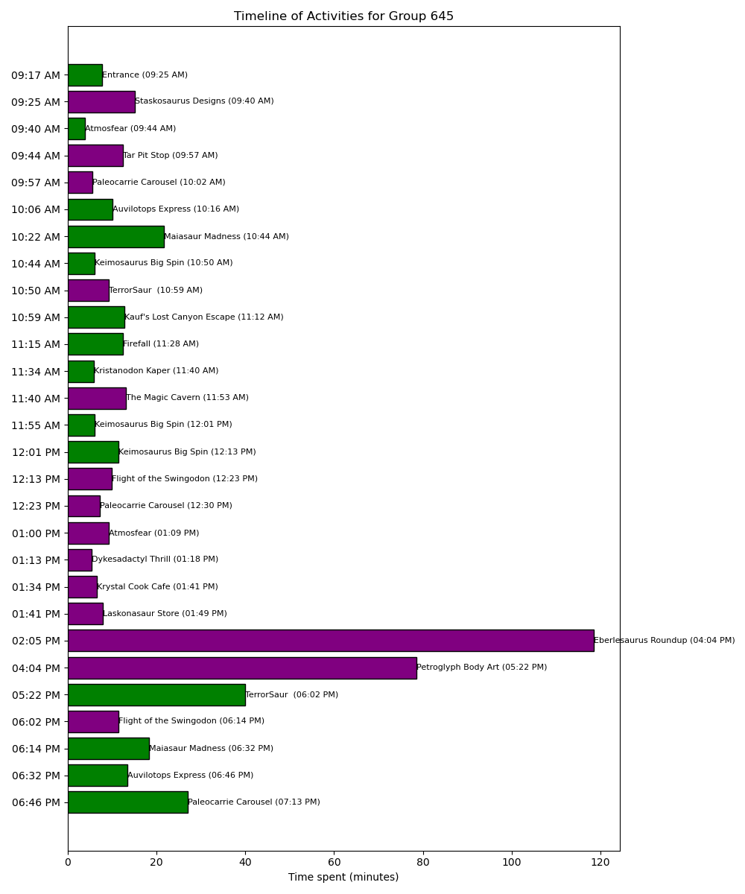
  
  Group 208 lies in cluster 2 (red dots)
  Green bar = 'check-in'
  Purple bar = 'movements'
  
  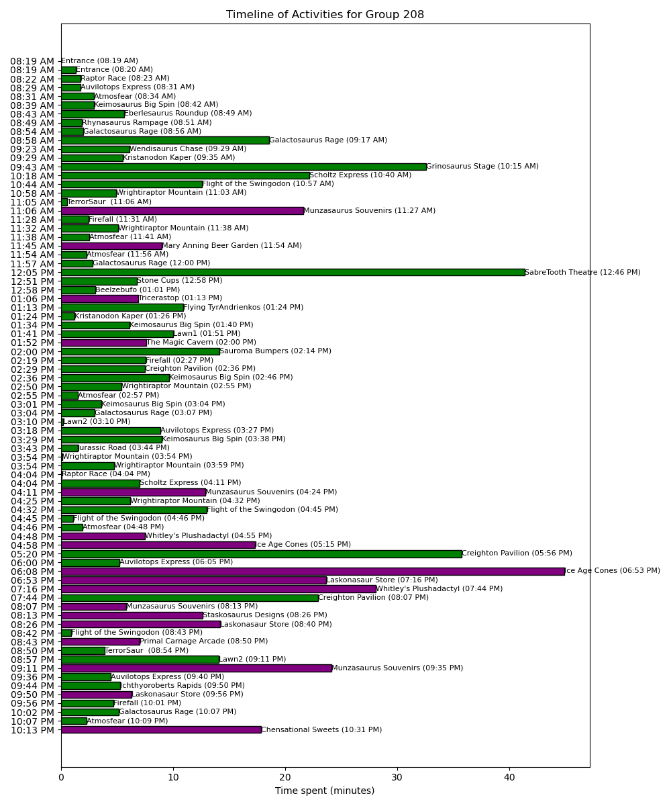
  
  Group 164 lies in cluster 3 (orange dots)SS
  Green bar = 'check-in'
  Purple bar = 'movements'
  
  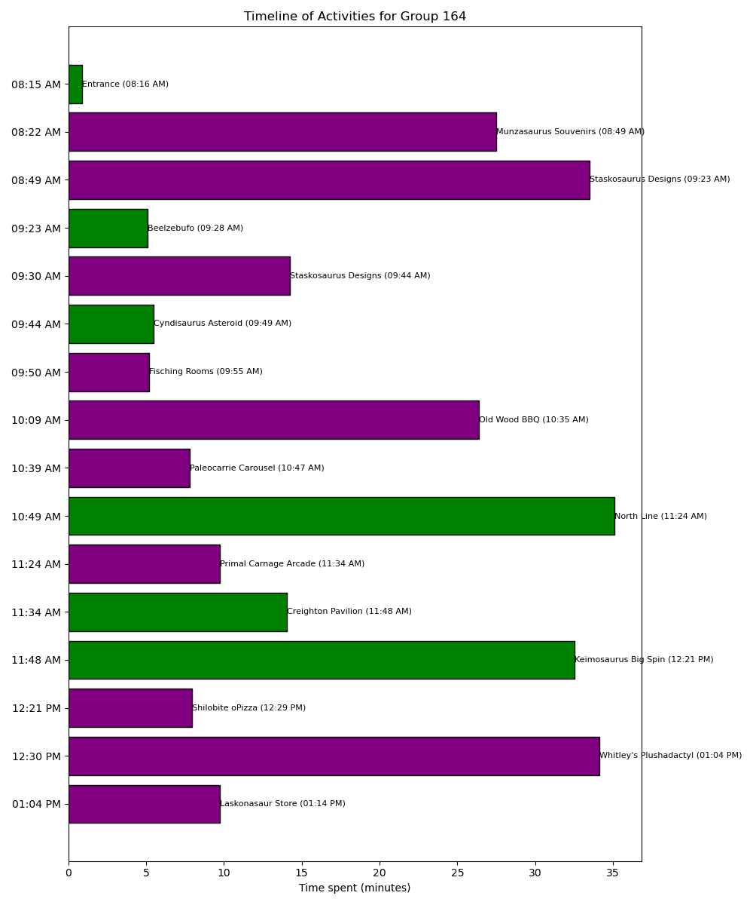

### Task 2 (6P)

The scatterplots' selection functionality also displays the IDs of selected
groups at the bottom of the app. Your next task is to identify outliers,
describe what makes them unusual and develop a visualization to analyze
their day.

An outlier, here, is an isolated point in a scatterplot, i.e. a somewhat
unusual group of visitors.

1.  Find three outliers and state for each one the group ID, in which
  plot you found the outlier, and why it is unusual, e.g.
  "This group stays much longer than any other group".
2.  Visualize the activities of the three outliers and briefly describe
  their activities. What could be a reason for their unusual behavior?
  (If you have not done exercise 2, task 2, or find it less suitable,
  fall back to your code from assignment 1.)


#### Outlier 1

- Group ID:411 (id: 1518969)
- Outlier in plot: Beer Garden Time vs. Kiddie
- Why is it unusual: It is unusual because it indicates a much higher Beer Garden Time compared to any other points. The majority of other points are clustered near the lower values of Beer Garden Time, whereas this group stays significantly longer.

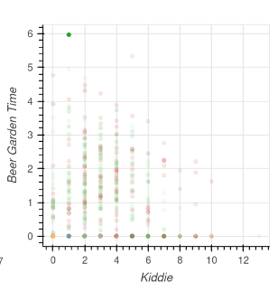

Group 411 spent a significantly longer time at the Stage Beer Garden compared to other groups, indicating a preference for socializing or resting there.

The group revisited the Stage Beer Garden multiple times throughout the day, showing a strong attachment to this location.


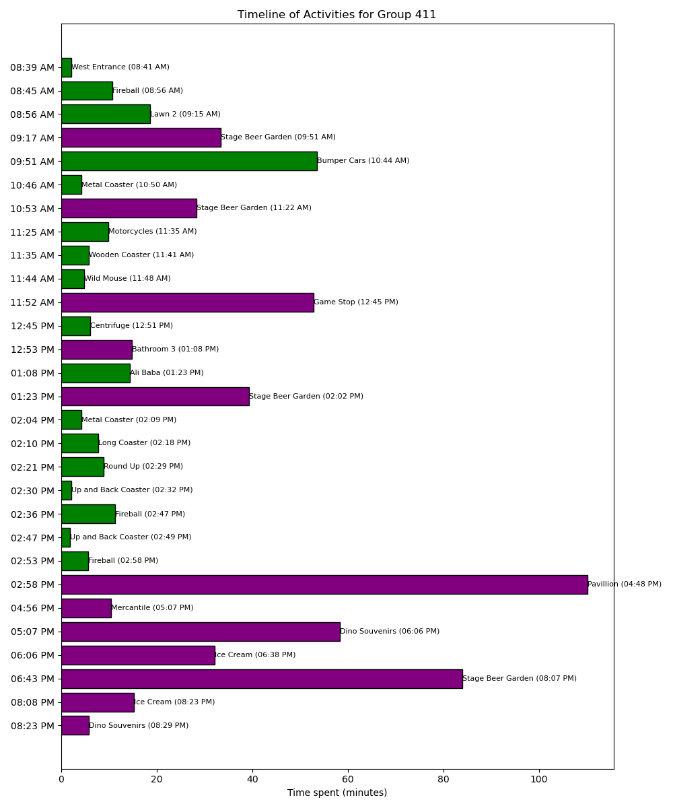


#### Outlier 2

- Group ID:284 (id: 850324)
- Outlier in plot: Beer Garden vs. GroupSize
- Why is it unusual: It is unusual because it represents a group with a significantly higher GroupSize compared to the majority of other groups. While most groups have a Beer Garden stay close to 0, this group has a high Beer Garden Time, 

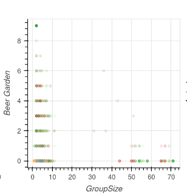

Group 284 spent much longer at the Stage Beer Garden than other groups.

The group frequently returned to the Stage Beer Garden and the Pavillion.

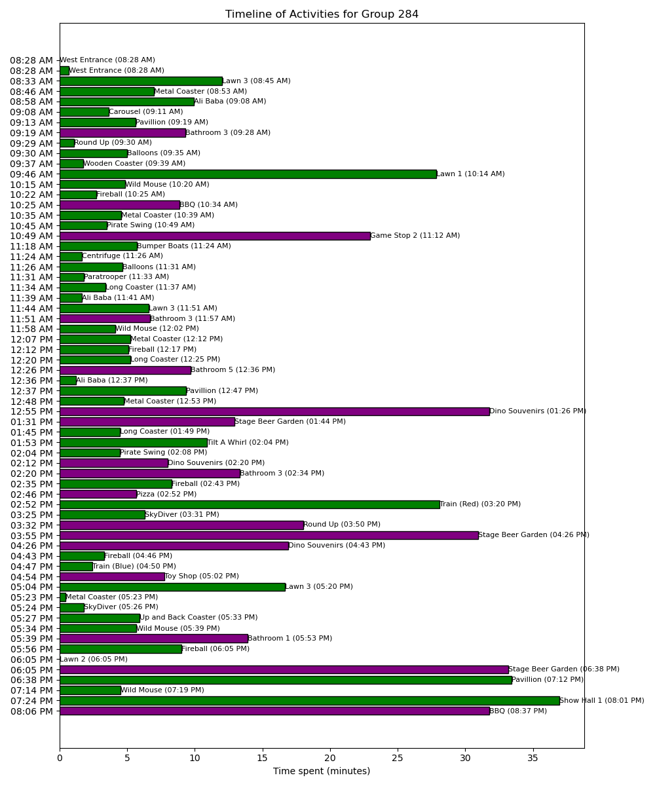

#### Outlier 3

- Group ID:117 (id: 7339)
- Outlier in plot: Kiddie vs. GroupSize
- Why is it unusual : It is unusual because it shows a group with a significantly higher Kiddie ride time compared to any other group. While most groups have a Kiddie ride time closer to the lower values, this group has a distinctly higher

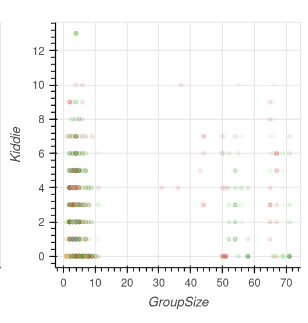

Group 117 spent significantly more time on Kiddie rides than other groups.

The group had prolonged, uninterrupted stays at certain attractions, such as a notably long time at the West Entrance.

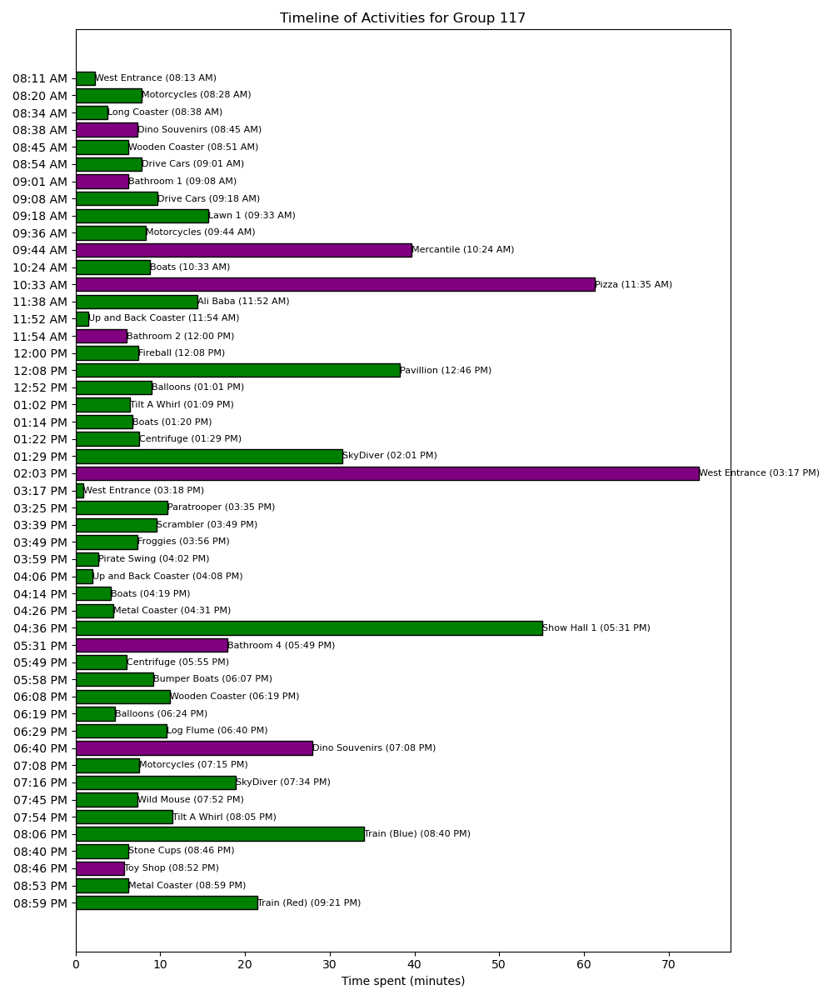