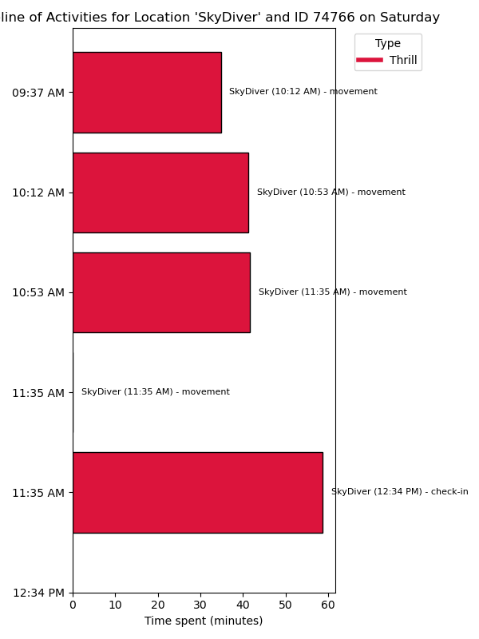
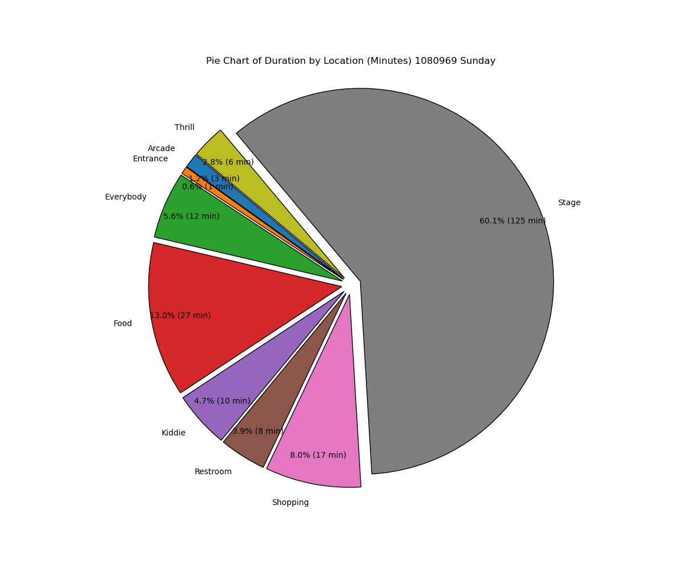
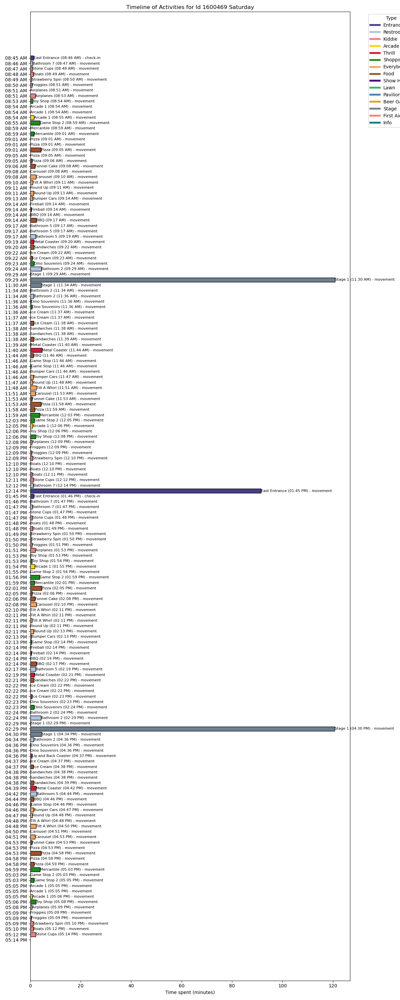
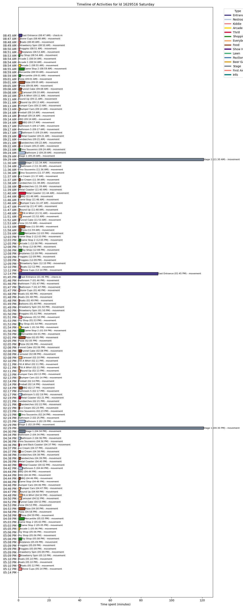
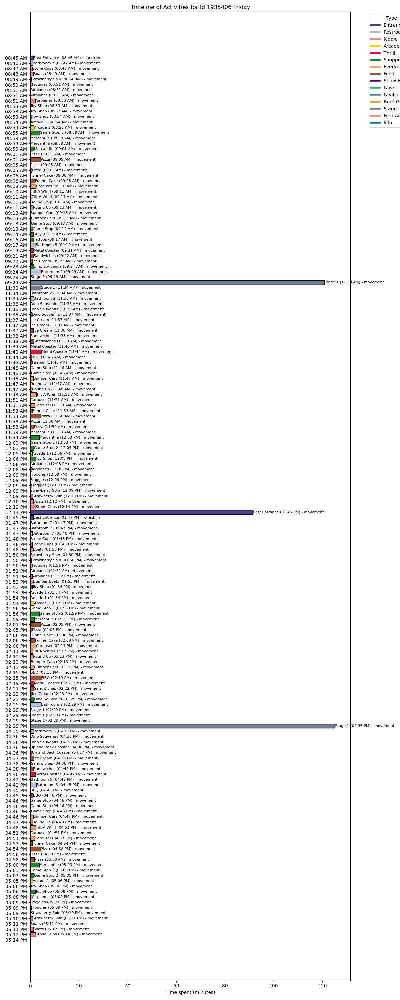
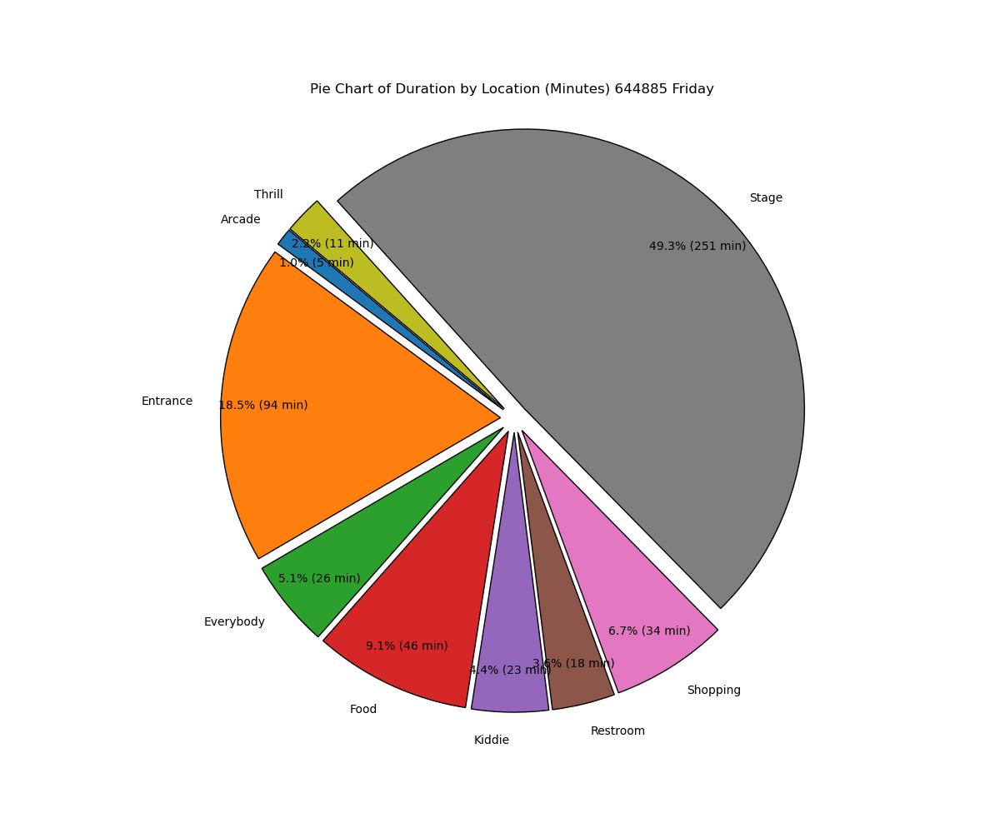
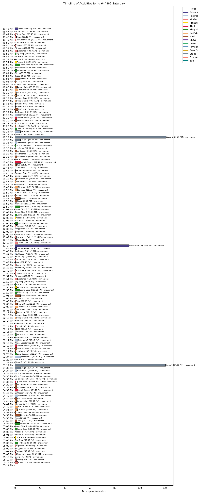

# Assignment 4: Analyzing Unusual Activities

In this assignment you will inspect unusual activities in the park including the
crime that happened. This assignment is an open data analysis and you are
allowed to choose from the following tasks.

Total points in this assignment: 32P (more than 100% is possible)

Notice that, regarding the multiple choice questions below, ticks can be made with an "x" in the brackets in the Markdown code.

## Exercise 1: Visitors with unusual activities (4 x 4P)

Explore the unusual behavior of the people listed below, fulfilling the following tasks.

1. Select the valid/likely statements about them by checking the respective items.
2. Describe the unusual pattern in their activities (around 50 words and at least one image per bullet point).

- Visitor 1187304
    * [ ] visits the park on Friday, Saturday and Sunday
    * [ ] loves Kiddie rides
    * [x] is a marathon roller coaster rider
  

Visitor 1187304's pattern on Saturday clearly showcases a dedication to thrill rides, particularly the Long Coaster. Out of the total 90 minutes spent in the park, 73 were on the Long Coaster alone, accounting for over 80% of their total park time. This intense focus on one thrilling ride, rather than exploring varied attractions, marks them as a "marathon roller coaster rider." Such behavior is atypical as most visitors tend to explore multiple attractions, confirming their specific interest in marathon roller coaster experiences. This visitor didnot visit the park on Friday and Sunday. During his jounrney in the park he didnt visit Kiddie rides even once.

Visitors 1187304: Profile on Saturday

Visitors 1187304: Shows that he spent most of the time in Long Coaster

Visitors 1187304: Shows number of visits at each location 

- Visitors 258464 and 74766
    * [ ] are real Scott Jones fans and watch all his shows
    * [x] take a couple of attempts to finally dare to go on the SkyDiver
    * [ ] get a tattoo
    
The behavioral patterns of visitors 258464 and 74766 at the SkyDiver attraction demonstrate a hesitancy typical of those building up courage for a thrilling experience. Data indicates that both visitors visited the SkyDiver multiple times (3 times) throughout the day but didnot check-in, before finally checking in at 11:34. Their frequent visits suggest preparation or hesitation. Figures also show that that they didnot get a tattoo and didnt watch all Scott Jones shows.
  
Visitors 258464: Profile on Saturday

Visitors 258464: Timeline of Activities for Location 'SkyDiver'

Visitors 74766: Profile on Saturday 

Visitors 74766: Timeline of Activities for Location 'SkyDiver'

- Visitors 657863, 1412235, 103006, 1937834, and 313073
    * [ ] are a family that spends the weekend in the park
    * [ ] spend more than 4 hours at the Ice Cream shop
    * [x] loose a friend on the train ride
  
The timeline visualizations highlight an unusual pattern concerning visitors 657863, 1412235, 103006, 1937834, and 313073 during their train ride on the Train (Red). While all these visitors boarded the train together at 09:53, they were expected to disembark together at 10:21. However, only visitors 1412235, 103006, 1937834, and 313073 checked out of the train and left the park shortly after at 10:29. In contrast, visitor 657863 did not disembark with the others and remained on the train overnight, finally exiting the park the next morning at 08:10 AM. This distinct discrepancy in 657863's timeline suggests that he/she was inadvertently left behind or "lost" during the train ride, separating himself/herself from their group. Also from the graph it is evident that they didnot spend time on weekend as they visited the park only on Friday. and none of then visited Ice Cream Shop during their whole period.

Visitors 657863: Profile on Friday and Saturday

Visitors 1412235: Profile on Friday

Visitors 103006: Profile on Friday

Visitors 1937834: Profile on Friday

Visitors 313073: Profile on Friday

- Visitors 1080969, 1600469, 1629516, 1781070, 1935406, 521750, and 644885
  * [ ] take more than 20 thrill rides per day
  * [ ] are security that accompany Scott Jones to his shows
  * [x] stay at the stage during the daily shows

The behavior of visitors 1080969, 1600469, 1629516, 1781070, 1935406, 521750, and 644885 at the park reveals a distinct pattern: they consistently spent extensive periods at the stage during daily shows. On both Friday and Saturday, they were present at the stage from 09:29 AM to 11:24 AM, and again from 02:29 PM to 04:34 PM, indicating they stayed to watch the performances in their entirety. This prolonged engagement at the stage, across multiple days, aligns with their interest in the shows rather than thrill rides, as there is no evidence of them partaking in more than 20 thrill rides per day. This focused attendance at the stage supports the observation that they were there specifically for the shows, likely as dedicated fans or possibly in an official capacity, or security that accompany Scott Jones to his shows rather than casual amusement park visitors.

Visitors 1080969: Profile on Friday

Visitors 1080969: Profile on Saturday

Visitors 1080969: Profile on Sunday 

Visitors 1600469: Profile on Friday

Visitors 1600469: Profile on Saturday

Visitors 1600469: Profile on Sunday 

Visitors 1629516: Profile on Friday

Visitors 1629516: Profile on Saturday

Visitors 1629516: Profile on Sunday 

Visitors 1781070: Profile on Friday

Visitors 1781070: Profile on Saturday

Visitors 1781070: Profile on Sunday 

Visitors 1935406: Profile on Friday

Visitors 1935406: Profile on Saturday

Visitors 1935406: Profile on Sunday 

Visitors 521750: Profile on Friday

Visitors 521750: Profile on Saturday

Visitors 521750: Profile on Sunday 

Visitors 644885: Profile on Friday

Visitors 644885: Profile on Saturday

Visitors 644885: Profile on Sunday 

## Exercise 2: Anomalies at attractions (4 x 4P)

Explore the unusual visitor patterns of the attractions listed below, fulfilling the following tasks.

1. Select the valid/likely statements about them by checking the respective items.
2. Describe the unusual pattern (around 50 words and at least one image per bullet point).

- Red Train "Scholtz Express" (ride 20): extraordinary closing?
    * [ ] gets closed on Friday
    * [x] gets closed on Saturday
    * [ ] gets closed on Sunday
  
From the analysis of the scatter plot data concerning the Red Train "Scholtz Express" (ride 20), it is observed that on Saturday, there is an unusual pattern of no check-ins recorded around 13:22 to 13:50. This gap in activity suggests that the attraction was unexpectedly closed during this period, which is not typical for such a popular ride. The abrupt absence of check-ins during these prime hours could indicate operational interruptions, possibly for maintenance or other unforeseen issues. 

Visual Evidence:
The scatter plot distinctly shows a lack of red points (check-ins) during the specified timeframe on Saturday, supporting the conclusion of an extraordinary closure. This visual gap contrasts with the consistent check-ins visible at other times, highlighting the anomaly. Where as from the below graphs, there were no such closing period on Friday and Sunday

Red Train "Scholtz Express" (ride 20): Profile on Friday

Red Train "Scholtz Express" (ride 20): Profile on Saturday

Red Train "Scholtz Express" (ride 20): Profile on Sunday 

Red Train "Scholtz Express" (ride 20): showing there was extraordinary closing on Saturday around 13:22 to 13:50

  
- Galactosaurus Rage (ride 2): problems with operation?
    * [ ] has no unusual patterns
    * [ ] the ride is stuck on Friday (people cannot get off for some time)
    * [x] the ride is closed for roughly one hour on Friday
  
For the "Galactosaurus Rage" ride (ride 2), the observed data clearly indicates an operational disruption on Friday. The pattern displayed shows an absence of check-ins around 19:03 to 20:02, suggesting the ride was closed during this hour. This unusual gap, particularly during an evening period typically characterized by high visitor activity, supports the conclusion that the ride experienced a significant operational issue, possibly for maintenance or due to a malfunction.

Visual Evidence:
The scatter plot distinctly lacks points in the 19:03 to 20:02 period on Friday, confirming the closure. This lack of activity is atypical for such a popular attraction during peak hours and indicates a noteworthy interruption in its operation, highlighting the anomaly. Where as from the below graphs, there were no such closing period on Saturday and Sunday. 
  
Galactosaurus Rage (ride 2): Profile on Friday

Galactosaurus Rage (ride 2): Profile on Saturday

Galactosaurus Rage (ride 2): Profile on Sunday 

Galactosaurus Rage (ride 2):shows the ride is closed for roughly one hour (19:03 to 20:02) on Friday

- Scott Jones show occurs at the Grinosaurus Stage (attraction 63): opening hours?
    * [ ] The stage is open: every day 8:00 - 11:00
    * [ ] The stage is open: every day 13:00 - 16:00
    * [x] Many people are not aware of the closing after the vandalism and try to go to the show on Sunday afternoon
  
At the Grinosaurus Stage (attraction 63), there's a notable pattern of visitor behavior that suggests a lack of awareness about operational changes following an incident of vandalism. The data from the scatter plots distinctly shows regular check-ins (marked in red) occurring primarily between 14:30 and 15:15 on Friday and Saturday, aligning with the expected show times. However, despite the stage's closure on Sunday afternoon, a significant number of movements (marked in blue) around the same time interval indicate that numerous visitors were still attempting to attend the show, unaware of the disruption in the schedule.

Visual Evidence:
The images from Sunday illustrate a clear influx of visitor movements around the usual show times without corresponding check-ins, emphasizing the confusion or lack of communication regarding the temporary closure. Images also show everyday Visitors Check-in around 9:30 to 10:15 in the morning and 14:30 to 15:15 in the afternoon. Hence the stage opening hour is not 8:00 in the morning and 13:00 in the afternoon.

Grinosaurus Stage (attraction 63): Profile on Friday

Grinosaurus Stage (attraction 63): Profile on Saturday

Grinosaurus Stage (attraction 63): Profile on Sunday 

Grinosaurus Stage (attraction 63):shows Many people are not aware of the closing after the vandalism and try to go to the show on Sunday afternoon

- Creighton Pavilion (attraction 32): opening hours?
    * [ ] is open all day
    * [ ] closes on Sunday at 11:00am
    * [x] hosts the exhibition of Scott Jones' memorabilia
    
The Creighton Pavilion's check-in patterns reveal that it doesn't operate continuously, particularly evidenced by a notable absence of check-ins during certain period of time everyday. It is not true that the attraction closing at 11:00 AM on Sundays,as from images,it shows activity extending beyond this time, with check-ins from 11:30 to 12:00 on Sunday. This supports the 3rd option i,e venue's use for special events, such as Scott Jones' memorabilia exhibition, indicated by consistent, scheduled visitor activities during specific hours.

Visual Evidence:
The provided images underscore these findings, displaying clustered check-ins during expected exhibition hours and clear inactivity periods that align with operational breaks or preparation periods for the next event.
  
Creighton Pavilion (attraction 32): Profile on Friday

Creighton Pavilion (attraction 32): Profile on Saturday

Creighton Pavilion (attraction 32): Profile on Sunday 

Creighton Pavilion (attraction 32): Shows the attarction is not open all day and doesnot closes on Sunday at 11:30 

  
## Exercise 3: What happened at Creighton Pavilion? (22P)

Eddie Smith and his accomplices Alice and Bob have been identified as the ones
vandalizing Creighton Pavilion and steeling the Olympic gold medal.
Their IDs are 1983765, 1089132, 1723967.
The police wants to understand how they went about the crime and ask the
following questions. 
(Include some images with your text answers as appropriate.)

1. What did these three people do during their stays in the park?
   Give a profile for the three days (each person and possible interactions).
   (12P)
   
   Activites vists and time spent by Eddie Smith on Friday
   
   
   
   
   
   
   
   Activites vists and time spent by Eddie Smith on Saturday
   
   
   
   
   
   
   
   Activites vists and time spent by Eddie Smith on Sunday
   
   
   
   
   
   
   
   Activites vists and time spent by Alice on Friday
   
   
   
   
   
   
   
   Activites vists and time spent by Alice on Saturday
   
   
   
   
   
   
   
   Activites vists and time spent by Alice on Sunday
   
   
   
   
   
   
   
   Activites vists and time spent by Bob on Friday
   
   
   
   
   
   
   
   Activites vists and time spent by Bob on Saturday
   
   
   
   
   
   
   
   Activites vists and time spent by Bob on Sunday
   
   
   
   
   
   
   
Profiles:

Alice's Profile:

Friday
On Friday, Alice's most notable locations included the Round Up, where she spent a significant 127.77 minutes, and the Tattoos shop, where she spent 78.62 minutes. Her day began with a check-in at the North Entrance at 09:17 AM, followed by activities at various attractions. Notably, she visited the Round Up multiple times, showing a preference for this ride throughout the day. Alice also spent a good amount of time at the SkyDiver, with a total of 51.52 minutes, making multiple stops here. Her visits to these attractions indicate her interest in thrill rides and shopping, punctuated by periodic rests at nearby restrooms.

Saturday
Saturday saw Alice spending the majority of her time at Ali Baba, with a total of 169.48 minutes, reflecting her fascination with this thrill ride. Her day started early with a check-in at North Entrance at 09:01 AM. Apart from Ali Baba, Alice also spent considerable time at SkyDiver, amounting to 67.90 minutes. She visited Fireball as well, dedicating 50.07 minutes to this attraction. Alice's Saturday was packed with excitement as she explored various thrill rides, showing a clear preference for the most exhilarating experiences the park had to offer.

Sunday
On Sunday, Alice's top locations included Wild Mouse, where she dedicated 144.08 minutes, and SkyDiver, with 76.73 minutes. Her day commenced at 08:06 AM with a check-in at North Entrance. The Ali Baba ride also captured her interest again, where she spent 75.27 minutes. Additionally, Fireball attracted her attention, with 62.50 minutes spent enjoying this thrill ride. Alice's Sunday activities were consistent with her previous days, showcasing a continued interest in the park's most thrilling attractions and spending considerable time at her favorite spots.

Bob's Profile:

Friday
On Friday, Bob's day at the park started with a check-in at the East Entrance at 09:32 AM. His most notable locations included Tattoos, where he spent 143.05 minutes, reflecting a significant interest in shopping. He also spent considerable time at Game Stop, totaling 68.10 minutes. Bob's thrill-seeking side was evident with his visits to Ali Baba and Fireball, where he spent 22.75 minutes and 36.00 minutes, respectively. His itinerary was diverse, combining shopping and thrill rides, and included multiple restroom breaks for a total of 8.40 minutes at various restrooms.

Saturday
On Saturday, Bob's day kicked off early at 08:53 AM with a check-in at the East Entrance. The highlight of his day was the Ali Baba ride, where he spent a significant 208.20 minutes, making it his top attraction. He also dedicated 76.80 minutes to the Fireball ride, demonstrating his preference for thrilling experiences. Bob enjoyed the Carousel for 61.95 minutes, and also had a notable interest in the Wild Mouse ride, where he spent 57.30 minutes. His Saturday activities were a blend of high-adrenaline rides and some leisure time at attractions like the carousel.

Sunday
Bob's Sunday began with a check-in at the East Entrance at 09:01 AM. He spent a substantial 185.27 minutes at the Ali Baba ride, indicating his continued fascination with this thrill ride. Apart from Ali Baba, his Sunday was relatively more relaxed compared to previous days. He spent time at various attractions, including SkyDiver for 35.30 minutes and Fireball for 36.00 minutes. Bob's activities also included some shopping and dining, although these were less prominent compared to his preference for thrill rides.

Eddie's Profile:

Friday
On Friday, Eddie's visit started with a check-in at the West Entrance at 09:28 AM. His most notable location was Lawn 2, where he spent a substantial 212.55 minutes, indicating a preference for relaxing and enjoying the open space. Eddie also spent significant time at the SkyDiver ride, totaling 77.40 minutes. Additionally, he visited Ali Baba multiple times, spending 34.67 minutes, showing his interest in thrill rides. His day also included short visits to various restrooms and the Magic Stand, where he spent 10.62 minutes shopping.

Saturday
On Saturday, Eddie began his day early with a check-in at the West Entrance at 08:28 AM. His top location was the Pavillion, where he spent 118.40 minutes, suggesting a mix of rest and social activities. Eddie also dedicated a significant amount of time to the Ali Baba ride, with a total of 101.55 minutes. The Bumper Cars attracted him for 85.03 minutes, and he spent 69.18 minutes at Stage 1. Additionally, he engaged in shopping at Game Stop 2, spending 59.83 minutes. His day was filled with a variety of activities, balancing thrill rides, socializing, and shopping.

Sunday
On Sunday, Eddie's visit commenced at 08:15 AM with a check-in at the West Entrance. The highlight of his day was the Train (Red) ride, where he spent 141.70 minutes, indicating a preference for a leisurely activity. He also visited the Pavillion for 41.30 minutes, continuing his trend of using the space for rest and social activities. Eddie's Sunday activities included visits to the Round Up ride, where he spent 6.50 minutes, and Scrambler, with a total of 4.98 minutes. His Sunday was comparatively relaxed, with a focus on leisurely and social activities.

Interactions:
   For Friday:
    
    Alice and Eddie:
     1. SkyDiver: Overlapped from 11:53 AM to 11:55 AM for approximately 2.13 minutes.
     2. Carousel: Overlapped from 12:23 PM to 12:26 PM for about 3.33 minutes.
     3. SkyDiver: Another brief overlap from 6:01 PM to 6:02 PM for about 1.13 minutes.
    
    Alice and Bob:
     1. Carousel: Overlapped from 10:19 AM to 10:22 AM for approximately 3.47 minutes.
     2. SkyDiver: A very brief overlap from 10:53 AM to 10:53 AM for about 0.03 minutes.
     3. SkyDiver: Another overlap from 10:53 AM to 10:59 AM for about 6.20 minutes.
     4. Round Up: Overlapped from 11:29 AM to 11:32 AM for about 2.23 minutes.
     5. Airplanes: A brief overlap from 1:31 PM to 1:31 PM for 0.15 minutes.
     6. Round Up: Another overlap from 2:19 PM to 2:23 PM for about 3.30 minutes.
     7. Tattoos: A significant overlap from 4:04 PM to 4:54 PM for about 50.27 minutes.
    
    Eddie and Bob:
     1. Ali Baba: Overlapped from 9:55 AM to 10:04 AM for about 8.67 minutes.
     2. Wooden Coaster: Very brief overlap from 12:11 PM to 12:11 PM for 0.03 minutes.
     3. Wooden Coaster: Another overlap from 12:11 PM to 12:16 PM for about 4.70 minutes.
     4. Whip: Overlapped from 12:20 PM to 12:23 PM for about 2.38 minutes.
     5. Game Stop: Overlapped from 12:28 PM to 12:29 PM for about 1.55 minutes.
     6. Dino Souvenirs: Brief overlaps from 7:08 PM to 7:09 PM for 0.22 minutes and from 7:19 PM to 7:19 PM for 0.20 minutes.
    
   For Saturday:
  
    Alice and Eddie:
    1. Ali Baba: They overlapped from 2:08 PM to 2:15 PM for approximately 6.58 minutes.
    2. Game Stop: Overlapped from 2:28 PM to 2:34 PM for about 5.77 minutes.
    
    Alice and Bob:
     1. Ali Baba: Multiple overlaps with the longest from 3:27 PM to 4:28 PM, totaling about 60.70 minutes.
     2. Game Stop: Overlapped from 12:50 PM to 12:56 PM for about 5.93 minutes.
     3. Fireball: Several brief overlaps around 5:05 PM with the longest being about 0.42 minutes.
     4. SkyDiver: A few short overlaps in the evening with the longest from 6:27 PM to 6:28 PM for about 0.75 minutes.
     5. Wild Mouse: Overlapped from 7:32 PM to 7:43 PM for about 11.50 minutes.
    
    Eddie and Bob:
     1. Ali Baba: They overlapped from 9:41 AM to 9:45 AM for about 4.43 minutes.
     2. Bathroom 2: Overlapped from 4:45 PM to 4:49 PM for about 3.67 minutes.
     3. Up and Back Coaster: Several brief overlaps around 5:56 PM with the longest being about 2.73 minutes.
     4. Carousel: Overlapped from 6:12 PM to 6:17 PM for about 4.55 minutes.
     5. Round Up: Overlapped from 6:57 PM to 6:58 PM for about 1.52 minutes.
     6. Bumper Cars: Overlapped from 7:04 PM to 7:16 PM for about 12.60 minutes.
    
   For Sunday:
    
    Alice and Eddie:
     1. Round Up: They overlapped from 8:26 AM to 8:30 AM for approximately 4.5 minutes.
     2. Round Up: Another brief overlap occurred from 8:32 AM to 8:32 AM for about 0.13 minutes.
     
    Alice and Bob:
     There were no overlaps detected between Alice and Bob on Sunday.
     
    Eddie and Bob:
     There were no overlaps detected between Eddie and Bob on Sunday.

 This analysis suggests that while Eddie, Alice, and Bob often visited the same types of locations, their interactions were more frequent in pairs rather than as a trio. This could indicate a strategy to avoid suspicion or to divide tasks among themselves. The frequent visits to areas near attractions and amenities may have provided opportunities to plan or execute the crime discretely.

   
   
2. What is a likely timeframe for the vandalism and did all three subjects
   participate? (6P)
   
Analysis of Creighton Pavilion Visits:
The data analysis shows that only Eddie check-in the Creighton Pavilion on all three days. Neither Alice nor Bob had any recorded check-ins to this location in their datasets (Bob's movement were recorded on Sunday for 17.96 minutes at 14:09 but he didnot check-in). Here is a detailed breakdown of Eddie's visits to the Pavilion:

Eddie's Visits to Creighton Pavilion

Friday:
13:39 PM to 14:05 PM: Eddie checked in at 13:39 PM and spent approximately 26.62 minutes at the Pavilion.

Saturday:
08:57 AM to 09:28 AM: Eddie checked in at 08:57 AM and stayed for about 30.03 minutes.
12:04 PM to 12:32 PM: Eddie checked in again at 12:04 PM for about 28.22 minutes.
15:45 PM to 16:29 PM: Another visit from 15:45 PM for about 44.62 minutes.
16:30 PM to 16:45 PM: Eddie's final check-in on Saturday lasted approximately 15.40 minutes.

Sunday:
08:32 AM to 09:13 AM: Eddie checked in at 08:32 AM and stayed for about 41.27 minutes.
Participation and Timeframe for Vandalism
Based on Eddie's frequent and significant time spent at the Pavilion, it is likely that he played a key role in the vandalism and theft. 

Here’s a plausible timeframe for the crime:

Friday:
Eddie's visit from 13:39 PM to 14:05 PM could have involved planning or initial acts of vandalism.

Saturday:
Eddie's visits, particularly from 08:57 AM to 09:28 AM and 12:04 PM to 12:32 PM, indicate substantial time spent, possibly coordinating with others or conducting acts of vandalism.

Sunday:
The visit from 08:32 AM to 09:13 AM could be the final act, involving the theft of the Olympic gold medal.
Alice and Bob's lack of presence at the Pavilion suggests they did not directly participate in the vandalism at this location. However, their interactions with Eddie, especially on other rides and locations, might indicate they were involved in planning or supporting roles.

Conclusion
Eddie was present at the Creighton Pavilion during critical times on all three days, making him the most likely primary participant in the vandalism and theft. Alice and Bob, while not present at the Pavilion, interacted with Eddie at various points, suggesting they could have been involved in planning or aiding the crime indirectly. The specific timeframe for the most critical activities would be during Eddie's prolonged visits, particularly on Friday afternoon and Saturday morning and early afternoon. 

   Timeline of visits to Creighton Pavillion by Alice, Bob and Eddie on Friday
   
   
   
   Timeline of visits to Creighton Pavillion by Alice, Bob and Eddie on Saturday
   
   
   
   Timeline of visits to Creighton Pavillion by Alice, Bob and Eddie on Sunday
   
   
   
   Timeline of Eddie's Activities in Creighton Pavillion Over all three days
   
   
   
   
   
3. Write a brief crime report using your findings from the two tasks above
   (and previous assignments). Make speculations where necessary
   (mark them as such). (4P)
   
   
Crime Report: Vandalism and Theft at Creighton Pavilion:

Summary of Events:
Over the weekend, from Friday to Sunday, Eddie Smith and his accomplices, Alice and Bob, have been identified as the primary suspects in the vandalism and theft of the Olympic gold medal at Creighton Pavilion. The analysis of their activities in the park reveals a detailed timeline and pattern that points to their involvement.

Detailed Timeline and Activities:

Friday:
Eddie Smith checked in at Creighton Pavilion from 13:39 to 14:05, spending approximately 26.62 minutes. This visit could have involved planning or initiating the vandalism. He also spent significant time at Lawn 2 (212.55 minutes) and SkyDiver (77.40 minutes).
Alice and Bob did not check in at the Pavilion but were active in other parts of the park, possibly coordinating with Eddie.

Saturday:
Eddie Smith had multiple visits to Creighton Pavilion:
08:57 to 09:28 (30.03 minutes)
12:04 to 12:32 (28.22 minutes)
15:45 to 16:29 (44.62 minutes)
16:30 to 16:45 (15.40 minutes)
These extended visits indicate that Eddie might have been conducting acts of vandalism or coordinating the theft.
Alice spent a significant amount of time at Ali Baba (169.48 minutes) and SkyDiver (67.90 minutes).
Bob was primarily engaged at Ali Baba (208.20 minutes) and Fireball (76.80 minutes).

Sunday:
Eddie Smith checked in at Creighton Pavilion from 08:32 to 09:13, spending approximately 41.27 minutes. This visit is likely when the final act of theft occurred.
Alice and Bob did not check in at the Pavilion on Sunday but were active in other parts of the park.

Interactions and Coordination:
On Friday, there were brief interactions between Alice and Eddie at SkyDiver and Carousel, and between Alice and Bob at various attractions. Eddie and Bob also had interactions, notably at Ali Baba and Game Stop.
On Saturday, Eddie interacted with both Alice and Bob at Ali Baba and other locations, suggesting coordination.
On Sunday, there were minimal interactions between Alice, Eddie, and Bob.

Speculations:
Based on the data, it is likely that Eddie Smith was the primary actor in the vandalism and theft, given his repeated and prolonged visits to Creighton Pavilion.
Alice and Bob, while not directly involved in the Pavilion activities, likely played supporting roles, such as keeping watch or distracting park staff and visitors.

Conclusion:
Eddie Smith's frequent and extended visits to Creighton Pavilion across the three days point to his central role in the crime. Alice and Bob's activities suggest they were accomplices, providing support through coordination and possible distractions. The crime likely involved meticulous planning, with the acts of vandalism occurring on Friday and Saturday, and the theft culminating on Sunday morning.
